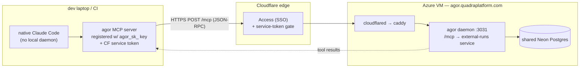
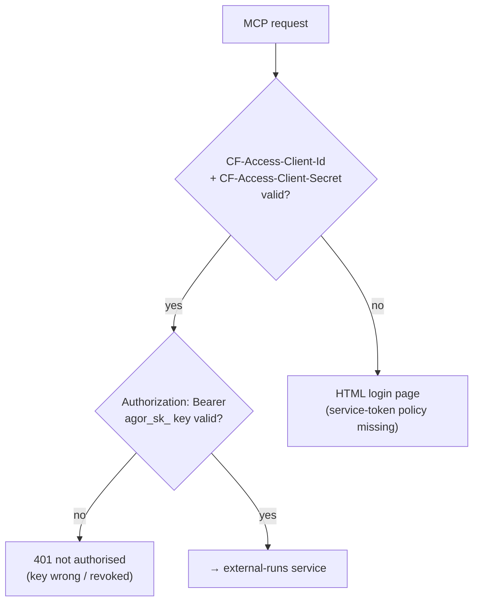
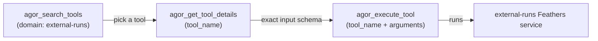
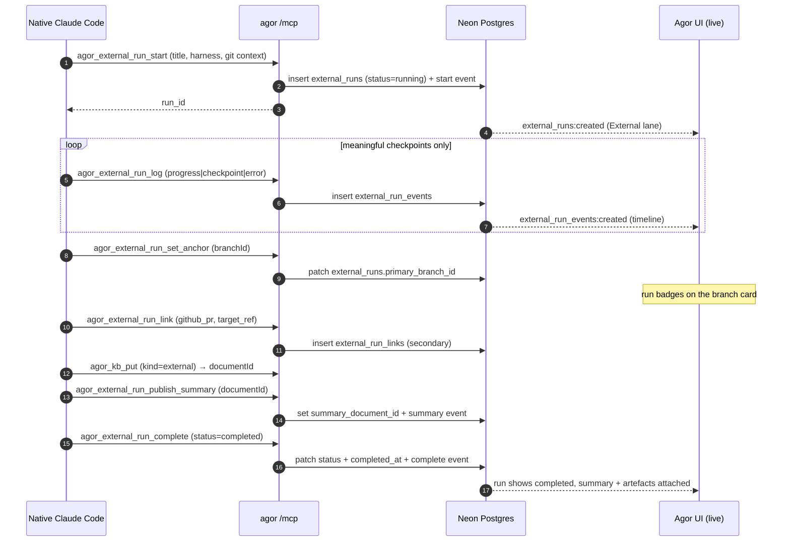
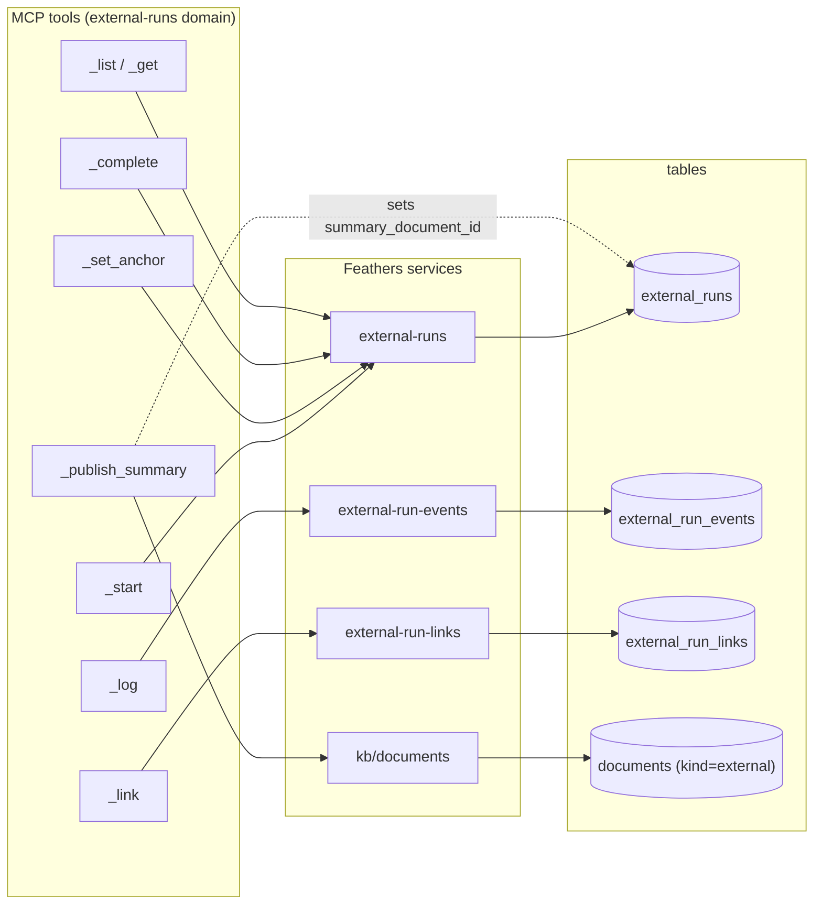
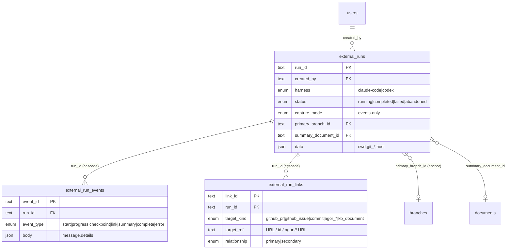
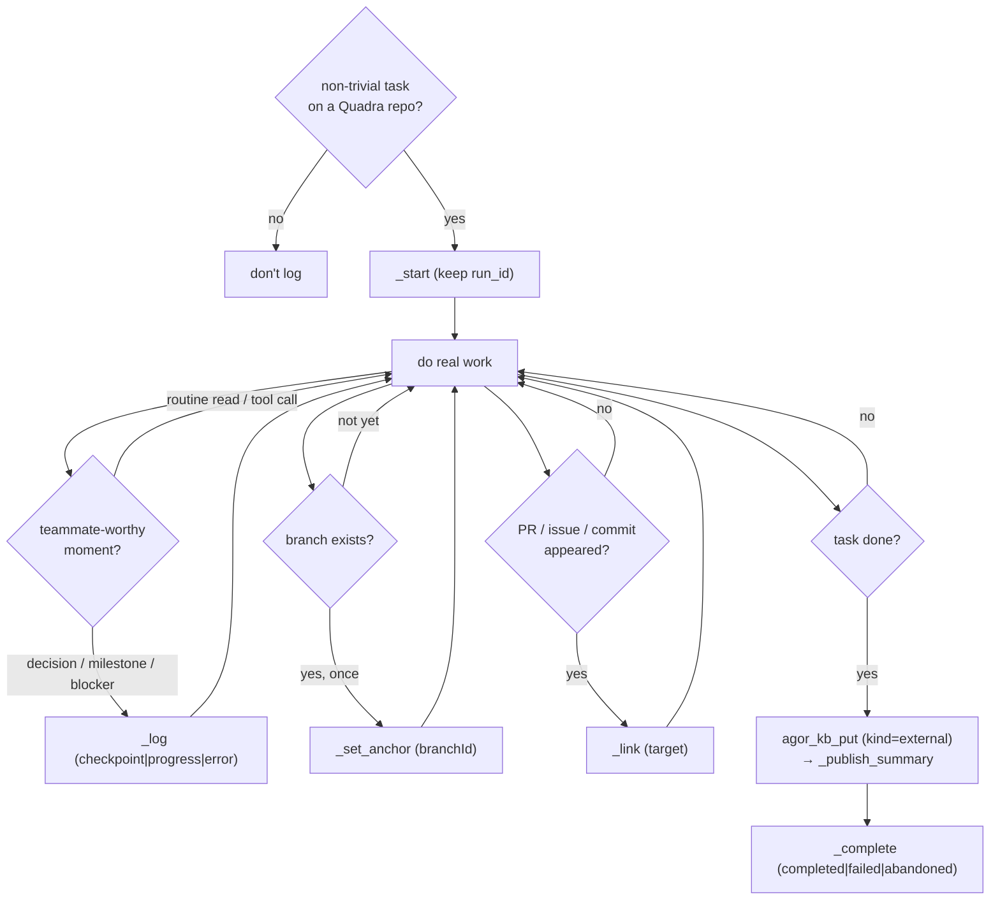

# External Runs — MCP + Skill Diagrams

**Status:** Reference (companion to `internal/external-runs-design-2026-06-22.md`)
**Date:** 2026-06-23
**Scope:** How a native harness (Claude Code) logs work back to central Agor as a
first-class **External Run** — the MCP transport, the tool lifecycle, the skill's
decision flow, and the data it writes.

Diagrams are [Mermaid](https://mermaid.js.org/) (GitHub renders inline). For the
full spec — tables, columns, build/deploy — see the design doc.

---

## 1. Architecture — native harness → central daemon

No local daemon. The native harness talks straight to the central VM's `/mcp`
over HTTPS, through Cloudflare Access. The daemon owns every write; the harness
only calls MCP tools. Same Neon DB the VM already uses, so every other
human/agent sees the run live.

**Auth = two credentials** (both as headers on every request):

---

## 2. Tool discovery — two-tier MCP flow

The `agor_external_run_*` tools are not listed flat; they surface through Agor's
progressive-discovery tier. The harness narrows from domain → schema → call.

> When scripting `claude -p --allowedTools`, allow the **server**
> (`mcp__agor`), not a bare tool name — the real tools live behind the three
> discovery tools above.

---

## 3. Run lifecycle — start → log → anchor → link → summary → complete

The canonical sequence the skill paces. Events are **structured, not the
transcript**; the harness self-paces (a 5-step refactor is ~1–3 events).

---

## 4. Tool → service → table map

What each MCP tool actually touches. (Knowledge is reused, not reinvented — the
summary is a normal KB document the run points at.)

---

## 5. Data model — entity relationships

---

## 6. Skill decision flow — when to call what

The `agor-logback` skill is the _process_: it teaches the agent **when** each
tool fires, so the human never drives them by hand. The rule of thumb: log what a
teammate would care about, summarize at completion.

**Summary contents** (`kind: external` KB doc): outcome · artefacts (PR / branch
/ files) · decisions · follow-ups. Default to summarizing **at completion**, not
mid-run.

---

## See also

- `internal/external-runs-design-2026-06-22.md` — full design + data model + phasing
- `skills/agor-logback/SKILL.md` — agent-facing when/how instructions
- `skills/agor-logback/references/setup.md` — credential + MCP registration detail
- `skills/agor-logback/DEMO.md` — per-dev demo & troubleshooting walkthrough
